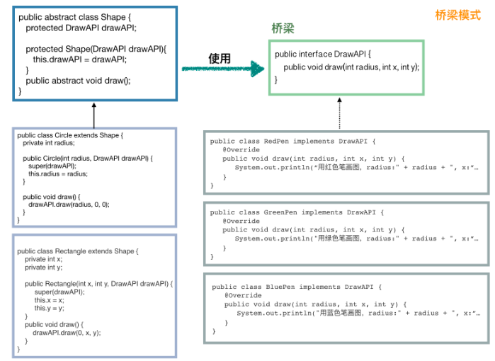

## 设计模式的原则
**参考文章: https://www.javadoop.com/post/design-pattern
https://blog.csdn.net/itest_2016/article/details/77963818  
https://blog.csdn.net/a724888/article/details/72637636**  

#### 1. 开闭原则
对修改关闭，对扩展开启。  
#### 2. 面向接口原则
面向接口设计，而不是面向实现。降低耦合，可扩展性强。  
#### 3. 职责单一原则
一个类只负责一个功能领域的相应职责。  
#### 4. 迪米特法则
尽量减少一个模块和其他模块间的耦合，以减少对其他类的依赖。

**根据用途，我们可以将设计模式分为三大类，分别为创建型模式，机构型模式，行为型模式**

## 创建型模式
作用是创建对象，提供多种创建对象的方式。  
包括简单工厂模式、工厂模式、抽象工厂模式、单例模式、建造者模式和原型模式。  
#### 1. 简单工厂模式
包含产品接口、具体产品和一个工厂类。一个工厂生产所有类型的产品。
#### 2. 工厂模式
包含产品接口、具体产品工厂接口和工厂类。有多个工厂类，每个工厂类对应生产一种产品。  
生产产品前先要选择需要的工厂。
#### 3. 抽象工厂模式
涉及到产品族时，产品之间可能存在兼容性问题，可以使用抽象工厂模式，一个工厂生产一族对应的产品。
#### 4. 单例模式
只实例化类的一个实例，每次返回该实例的引用。不用频繁新建实例，重复利用。  
 1) 饿汉模式:  初始化时就先把单例实例化，获取时直接返回单例即可。
 2) 懒汉模式:  与饿汉模式不同，懒汉模式下，类在实例化的时候才创建对象，不会存在内存的浪费。  
 但可能会出现线程安全问题，多个线程可能同时创建实例。**解决方法:**  
 - 通过synchronized关键字和双重校验

    ``` java
    public class Singleton {
        // 首先，也是先堵死 new Singleton() 这条路
        private Singleton() {}
        // 和饿汉模式相比，这边不需要先实例化出来，注意这里的 volatile，它是必须的
        private static volatile Singleton instance = null;
     
        public static Singleton getInstance() {
            if (instance == null) {
                // 加锁
                synchronized (Singleton.class) {
                    // 这一次判断也是必须的，不然会有并发问题
                    if (instance == null) {
                        instance = new Singleton();
                    }
                }
            }
            return instance;
        }
    }
    ```
    synchronized关键字的锁机制造成的性能较差。
 - 嵌套类方式
    ``` java
    public class Singleton3 {
        private Singleton3() {}
        // 主要是使用了 嵌套类可以访问外部类的静态属性和静态方法 的特性  该类被调用时才装载
        private static class Holder {
            private static Singleton3 instance = new Singleton3();
        }
        public static Singleton3 getInstance() {
            return Holder.instance;
        }
    ```
#### 5. 建造者模式
通常命名为xxxBuilder, 通过链式传递构造对象，给属性赋值。当有很多属性，有些需要设置，有些不设置时，会比较清晰。
#### 6. 原型模式
有一个原型实例，当需要实例化对象时，克隆该原型对象。该模式中的克隆应该为深克隆，一般实现的方法是先将对象序列化，然后再反序列化生成对象。

**简单工厂模式最简单；工厂模式在简单工厂模式的基础上增加了选择工厂的维度，需要第一步选择合适的工厂；抽象工厂模式有产品族的概念，如果各个产品是存在兼容性问题的，就要用抽象工厂模式。单例模式就不说了，为了保证全局使用的是同一对象，一方面是安全性考虑，一方面是为了节省资源；建造者模式专门对付属性很多的那种类，为了让代码更优美；原型模式用得最少，了解和 Object 类中的 clone() 方法相关的知识即可。**

## 结构型模式
结构型模式旨在通过改变代码结构来达到解耦的目的。
#### 1. 代理模式
比较常用的设计模式，通过一个代理来隐藏实现细节，还可在进一步在实现前后增加处理。  
可以看做是“方法包装”或“方法增强”，**举例:**面向切面编程(AOP)，就是通过动态代理来实现的，在Spring中，会为用户定义动态代理，我们只需要在@Before，@After等注解之后定义要添加的功能即可。
#### 2. 适配器模式
假设有一个接口需要实现，但现有的对象都不满足，通过适配器来包装对象来实现接口。
有默认适配器模式，对象适配和类适配。
**对象适配:**定义一个类实现接口，其中包含另一个类对象作为属性，利用该对象的方法实现接口方法的实际功能。
    ``` java
    // 毫无疑问，首先，这个适配器肯定需要 implements Duck，这样才能当做鸭来用，实际的方法是通过鸡的对象来实现
    public class CockAdapter implements Duck {
        Cock cock;
        // 构造方法中需要一个鸡的实例，此类就是将这只鸡适配成鸭来用
          public CockAdapter(Cock cock) {
            this.cock = cock;
        }
     
        // 实现鸭的呱呱叫方法
          @Override
          public void quack() {
            // 内部其实是一只鸡的咕咕叫
            cock.gobble();
        }
     
          @Override
          public void fly() {
            cock.fly();
            }
    }
    ```

**代理模式和适配器模式异同: 都需要另外的类来间接的提供定义的功能；代理是实现增强，适配器模式是实现适配，是把鸡包装成鸭，鸡和鸭之间并没有继承的关系；代理是有正常的实现，套上一层壳，适配器是套一层壳，换上其他对象来实现**

#### 3. 桥梁模式
实现解耦


#### 4. 装饰模式
增强类功能

#### 5. 门面模式
为多个类提供外观，通过方法名来决定调用哪个类来实现。

#### 6. 组合模式
描述具有结构层次的数据，比如类A有age，name属性和children集合，child对象也有age，name和children集合。


## 行为型模式
**参考文章：https://blog.csdn.net/a724888/article/details/71420202**  
行为型模式关注的是各个类之间的相互作用，将职责进行划分

#### 1. 策略模式
比较常用的设计模式，通过接口定义操作，接口的多个实现类中有不同的实现，使用时根据传入的不同实现类对象，可以实现多样的操作  
比如Strategy接口中定义了画图draw操作，其实现类中可以定义使用不同颜色的笔来画图，在我们使用Strategy时，传入不同的实现类对象便可不出不同颜色的图  

#### 2. 观察者模式
观察者订阅自己关心的事件，当事件发生时通知观察者  
观察者模式中的角色有主题Subject和Observer，Subject会维护一个观察者列表，当事件发生时通知观察者，即调用观察者对象的处理方法，新建Observer时可以进行主题的订阅（将观察者对象加入Subject的观察者列表中）

#### 3. 责任链模式
通常用于执行一个任务需要多步处理时，通过一个单向链表多个步骤的处理类连接起来，比如规则验证时，需要验证规则A，B，C，D
可以设计抽象类
``` java
public abstract class RuleHandler {
    // 后继节点
    protected RuleHandler successor;
    // 执行操作
    public abstract void apply(Context context);
 
    public void setSuccessor(RuleHandler successor) {
        this.successor = successor;
    }
    public RuleHandler getSuccessor() {
        return successor;
    }
}
```
所有规则都继承该类，并按需要设定后继节点，按顺序验证规则，好处是可以自定义需要验证的规则和顺序  

#### 4. 模板方法模式
定义一个抽象类，在其中定义一系列方法，抽象类中只实现模板方法调用其他方法，其他方法可以交由子类来实现  
如

``` java

public abstract class AbstractTemplate {
    // 这就是模板方法
      public void templateMethod(){
        init();
        apply(); // 这个是重点
        end(); // 可以作为钩子方法
    }
    protected void init() {
        System.out.println("init 抽象层已经实现，子类也可以选择覆写");
    }
    // 留给子类实现
    protected abstract void apply();
    protected void end() {
    }
}
其中apply，end方法由不同子类来做不同的实现
```
#### 5. 状态模式
定义State接口表示状态，其实现类表示具体的状态，比如销售时减库存和加库存状态，在实现类中实现具体的状态操作，比如增加库存和减少库存

