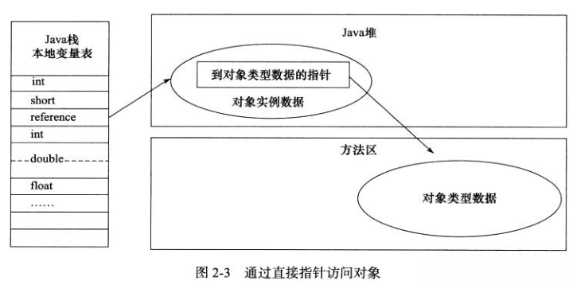

## Java内存区域
#### Java内存溢出故障排查
生成Heap Dump文件，使用专用的软件，如MAT分析dump文件

## 垃圾收集 GC
#### 可回收对象的判定
- 引用计数  
对于循环引用，无法收集
- 可达性算法  
通过GC roots到对象是否有引用链来判断对象是否需要回收  
可作为GC roots的对象有：  
1). 虚拟机栈中的对象引用  
2). 本地方法栈中的对象引用  
3). 方法区中的静态变量引用  
4). 方法区中的常量引用  

在OopMap中记录了栈上的本地变量到堆中对象的引用关系，在垃圾收集时可以根据这个数据结构直接找到GC roots而不必扫描整个栈  

#### 垃圾收集算法
- 标记-清除  
内存不连续，原地清除，没有复制的开销
- 复制  
内存连续，内存利用率降低
- 标记-整理  
内存连续，在同一块内存中将存活对象沿顶端复制
- 分代收集    
垃圾收集的策略，把对象分为新生代和x老年代，在新生代和老年代采取不同的收集策略

#### 垃圾收集器
新生代收集器 Serial复制  ParNew复制  Parallel scavenge复制  
老年代收集器 Serial Old标记-整理  Parellel Old标记-整理 CMS标记-清除  
可以同时对新生代和老年代进行回收 G1  

#### 新生代都是复制算法，为什么不使用标记-整理算法
复制算法在对象可达后，可以直接执行复制操作，而标记整理中需要先统一标记，完成后才能整理，效率相对低  

老年代为什么不使用复制算法?  
老年代中存活对象较多，使用复制算法会使空间利用率较低，也就是需要保证较大的surviver区  

**Serial：**  
采用复制算法，串行的垃圾收集器，只有单线程工作，并且在收集时需要停止其他工作线程，在client模式下是默认的新生代收集器  

**ParNew：**  
采用复制算法，是Serial的多线程版本，多个垃圾收集线程同时工作，在收集时会停止其他工作线程，在Server模式下，只有Serial和ParNew可以与CMS（老年代垃圾收集器）一起工作，之所以Parallel Scavenge（还有G1）不能与CMS配合使用，是因为它们没有使用传统的垃圾收集框架，而是独立实现  

**Parallel Scavenge：**  
采用复制算法，多线程收集器，关注吞吐量  
CMS和其他收集器都是尽量减少停顿时间，更适合与应用交互的场景。  
Parallel scavenge主要的关注点是达到可控制的吞吐量，吞吐量是指(cpu执行用户线程的时间)/(cpu执行用户线程的时间+垃圾收集的时间=cpu的实际运行时间)，更适合做后台运算。  
它提供两个参数用来控制最大的垃圾收集时间和直接设置吞吐量大小  
**会更倾向于与减少垃圾收集次数，当吞吐量不能满足要求时，会增加代的内存来增加用户运行的时间**  

对运行在client模式下的虚拟机，serial是默认的新生代垃圾收集器。  
serial Old是serial的老年代版本，用于对老年代的对象进行收集，它主要在client模式中实现垃圾收集，在server模式下，它可以与parallel scavenge配合使用，还作为CMS收集器的后备预案。  

**Serial Old：**  
采用标记-整理算法（还有压缩 mark-sweep-compact），Serial的老年代版本，单线程收集器  

**Parallel Old：**  
采用标记-整理算法，Parallel Scavenge收集器的老年代版本  

**CMS：**  
采用标记-清除算法，CMS是以实现最小停顿时间为目标的垃圾收集器，收集过程分为四步  
- 初始标记  标记GC roots能直接关联的对象，速度很快
- 并发标记  进行GC roots tracking，标记存活对象
- 重新标记  标记在并发标记阶段导致标记变动的对象
- 并发清除
只在初始标记和重新标记阶段会发生STW，并且这两个过程耗时很短。  

CMS算法的缺点是
- 对CPU资源敏感，虽然并发，但需要占用cpu资源进行垃圾收集，默认使用回收线程数是(CPU数量+3)/4,其回收线程数由cpu数来决定
- 无法处理浮动垃圾，在并发清除阶段也会产生垃圾，这些垃圾只能在下一次进行清理。可能会因此出现 concurrent mode failure而导致full GC的发生。需要调用Serial Old，导致full gc的发生  
- 采用标记-清除，会导致内存碎片，如果找不到足够大的连续内存分配对象，也会触发full GC  

**G1：**  
管理整个GC堆（新生代和老年代），面向服务端的收集器，它也可以与应用程序并行执行。整体上看采用标记-整理算法，region之间看是复制算法。
与CMS相比：  
- 采用标记-整理算法，不会产生内存碎片  
- 建立了可预测的停顿时间模型，可以将停顿时间控制在用户设定的时间之内  
G1能建立可预测的停顿时间模型，是因为它对堆空间的分配与传统的新生代老年代不同，传统的新老生代分配内存都是连续的，而G1收集器各代的存储地址是不连续的，每一代都使用n个大小相同的不连续的Region，还分配了H区用于存储大的对象，直接进入老年代。  

G1收集器对这些region分别计算垃圾收集价值（回收能得到的空间及回收的一些经验数据），维护一个优先列表，在进行需要进行垃圾收集时，根据设定的收集时间，优先选择收集价值大的region，而不是像full GC一样对所有区域进行收集

它的收集过程：
- 初始标记
- 并发标记
- 重新标记
- 筛选回收  在该阶段对各region的回收价值和成本进行排序，然后根据期望停顿时间进行筛选回收

其中只有并发标记是与工作线程同时进行的

**参考文章：[article](https://blog.csdn.net/u011445156/article/details/90183811)**  
**当判断一个region中对象是否存活时，可能存在其他region对它的引用，这里如果全局扫描，效率很低**，在JVM的垃圾收集器中，使用remembered set来避免全局扫描  
每个region对应一个remembered set，如果region中对象包含的引用发生变化，会判断被引用对象是否在当前region，如果不在，会在被引用对象所在region的remembered set中记录下来，在垃圾收集时remembered set与GC roots一起作为查找起点,remember set 中记录了自家的对象被外界引用的情况。  

当我们进行新生代垃圾收集时，由GC roots做扫描时不必要扫描老年代对象，但又有可能存在老年代到新生代的引用，虚拟机采用了空间换时间的方法，当老年代对象引用了新生代对象时，引用信息维护在remembered set中，这样进行新生代垃圾收集时，GC root扫描时忽略老年代对象，老年代对新生代的引用由remember set记录，即通过GC root+remember set来分析存活对象。  

**Java 8中默认的垃圾收集器：**  
**参考文章： [article](https://docs.oracle.com/javase/8/docs/technotes/guides/vm/gctuning/collectors.html#sthref27)**  
Paralell Scavenge + Parallel Old    
**Parallel compaction is enabled by default if the option -XX:+UseParallelGC has been specified. The option to turn it off is -XX:-UseParallelOldGC.**  

**垃圾收集中stop the world与safe point:**   
在full GC与minor GC中都会出现stop the world，此时只有垃圾收集线程在工作，会造成服务的停止。  
stop the world不会随时进行，它发生在safe point，只在确定安全时才进行，安全点的主要位置有
- 循环的末尾
- 方法返回前
- 调用方法的call之后，也就是方法执行前
- 抛出异常的位置
存在safepoint的原因是hotspot虚拟机为实现准确式gc，利用OopMap来存储栈上对象的引用类型信息，而OopMap在类加载时生成，存储在方法的一些重要位置处（避免在每一条语句后存储占用大量内存），这些位置处才能开始GC，称为safepoint
**参考文章：[article](https://www.pudn.com/news/628f83bdbf399b7f351eb02d.html)**

## Java对象创建  内存布局  访问定位
**参考文章:[Java内存区域](https://github.com/Snailclimb/JavaGuide/blob/3965c02cc0f294b0bd3580df4868d5e396959e2e/Java%E7%9B%B8%E5%85%B3/%E5%8F%AF%E8%83%BD%E6%98%AF%E6%8A%8AJava%E5%86%85%E5%AD%98%E5%8C%BA%E5%9F%9F%E8%AE%B2%E7%9A%84%E6%9C%80%E6%B8%85%E6%A5%9A%E7%9A%84%E4%B8%80%E7%AF%87%E6%96%87%E7%AB%A0.md)**  
#### 1. Java对象创建的五个过程
**类加载检查:** JVM在new一个对象的时候，根据指令参数检查常量池中的符号引用。确定对象的类是否已经被加载、解析和初始化过。  

**内存分配:** 通过类加载检查之后，虚拟机开始为对象分配内存，对象所需的内存此时已经是确定的。分配内存的方法有**指针碰撞**和**空闲列表**两种，具体使用哪种要根据使用的垃圾收集算法来确定，因为垃圾收集算法决定了内存是否规整。  
如果使用“**标记-清除**”算法，那么内存是不规整的，需要使用空闲列表方式，该方式维护了一个标记可用内存的空闲列表，虚拟机从中选择一个连续的足够大的内容区域分配给对象。  
如果使用**复制或标记-整理**算法，一次垃圾收集中，把不需要清理的对象全部移动到另一部分内存区域中。此时内存是规整的，可以使用指针碰撞方式，直接将没使用的内存区域指针移动一部分分配给对象。  
内存分配可能存在线程安全的问题，hotspot虚拟机通过**TLAB**和**CAS+失败重试**来为对象分配内存，保证对象的分配是线程安全的，TLAB是虚拟机为每一个线程在Java堆中分配了一段内存，当TLAB内存用尽时，再通过“CAS+失败重试”来为对象分配内存。

**初始化零值:** 该过程把分配的内存区域清零，这样可以保证生成的对象参数都有零值，不需要赋初值就可以直接使用。  

**设置对象头:** 对象初始化零值之后，要设置对象头信息，其中包括对象所属的类、如何找到该类、对象哈希值、分代年龄信息等，还有对象锁信息。  

**执行init:** 以上工作完成之后，从虚拟机的视角来说，一个对象已经完成了，接下来会执行init方法，根据Java代码对对象进行初始化。 该init方法包含对象父类的属性初始化、语句块、构造函数和该类的属性初始化、语句块、构造函数。  

#### 2. 对象的内存布局
Java对象占用的内存可以分为三个部分  
**对象头:** 该部分存储对象所属的类、如何找到该类、对象哈希值、分代年龄和是否加锁等信息。  
**实例数据部分:** 这部分存储的才是对象的属性等实际信息。  
**对齐部分:** hotspot虚拟机要求对象的总内存需要是8字节的整数倍，否则需要进行对齐占位。  

#### 3. 对象的访问定位
Java实例变量中存储的是对象的reference，访问时根据reference定位Java堆中实际的对象，定位的方式根据使用的虚拟机不同，主要有两种：  
- 句柄方式：每一个对象都在堆中创建一个句柄，存储对象的实际地址和到对象类型数据的指针(指向方法区)，然后再根据实际地址访问堆中的对象  
  
- 直接访问：reference直接指向堆中的对象地址，无需通过句柄再次定位，但堆中需要分配位置存储类信息地址  
  
**这两种方式各有优势，直接访问的访问速度更快，省去了句柄中的一次访问，但每次堆中对象位置改变都要更新reference的值，而句柄方式中修改句柄中的地址即可，reference指向的是稳定的句柄地址，更方便**  
**Sun hotspot虚拟机采用直接访问方式定位对象**  

## 类加载过程
**参考文章：[article](https://baijiahao.baidu.com/s?id=1636309817155065432&wfr=spider&for=pc)**  
类的加载分为加载，验证，解析，准备，初始化5个阶段  
验证，解析，准备统一叫做连接阶段  
加载，验证，准备，初始化的顺序不会改变，但解析发生的阶段不是固定的。  

- 加载  
通过类的**全限定名**找到对应的**二进制流**文件  
将文件中的**静态存储结构**转换为**方法区**中的数据结构  
在**堆中**生成Class对象，作为方法区中类数据的访问入口  
- 验证  
进行class文件的验证，保证文件能被虚拟机正确加载且不会对虚拟机造成危害  
验证过程分为文件格式验证，元数据验证，字节码验证，符号引用验证  
文件格式验证：.class文件是否符合class文件的格式（魔数等），还有当前虚拟机的版本是否符合要求  
元数据验证：是否有父类，父类是否可继承，是否实现了父类或接口要求实现的方法，是否访问父类中不允许访问的成员  
字节码验证：这个阶段主要进行字节码中的语句验证，确定语句是否合法，符合逻辑，保证跳转指令不会调转到方法体以外  
符号引用验证：在解析阶段进行，确保符号引用可以被正确转化为直接引用  
- 解析  
把符号引用转换为直接引用，符号引用中存储的是字面量，用来标识目标和无歧义的定位到目标，而直接引用用于指向实际的对象。  
- 准备  
准备阶段生成类变量（静态变量），此时类变量中的值是零值，类变量赋初值的过程在初始化阶段进行  
- 初始化  
该阶段执行类构造器<cinit()>方法对类进行初始化，cinit方法中收敛了静态变量赋初值的语句，同时还有静态语句块中的内容，会根据声明顺序调用这些语句来完成类的初始化  
**类初始化的时机**:
	- 通过new来新建一个实例时
	- 访问类的静态属性或者静态方法时
	- 通过反射访问类时
	- 初始化某个子类，其父类也会被初始化
	- 将类指定为启动类时

## ClassLoader与双亲委派模型
**参考文章：[article](https://blog.csdn.net/briblue/article/details/54973413)**  

ClassLoad是指类加载器，其作用是把.class中的类加载到虚拟机中  
Java中自带有三个类加载器，**它们都是加载指定路径下的类**：  
- Bootstrap ClassLoader 启动类加载器，最顶层的加载器，用本地代码实现的加载器，负责加载%JAVA_HOME%/jre/lib下的核心类库如rt.jar,resources.jar,charset.jar等。另外需要注意的是可以通过启动jvm时指定-Xbootclasspath和路径来改变Bootstrap ClassLoader的加载目录。
- ExtClassLoader，扩展类加载器，负责加载%JAVA_HOME%/jre/lib/ext下的jar包和class文件  
- AppClassLoader，系统类加载器，负责加载应用程序的类  
其中Bootstrap ClassLoader是c++代码实现的，它是虚拟机的一部分，其他两个加载器是java类  
它们的运行顺序是Bootstrap ClassLoader-》Extention ClassLoader-》AppClassLoader  

**自定义加载器：**   
重写findClass()方法，在父类加载器不能加载时，调用该方法查找类  

**双亲委派模型:**  
当类加载器收到类加载请求时，它首先将加载请求传递给父加载器去加载，最终所有类加载请求都会传递到Bootstrap ClassLoader中，当父加载器无法加载时，子加载器才尝试进行加载。  

**contextClassLoader：**  
**参考文章：[article1](https://blog.csdn.net/justloveyou_/article/details/72231425), [article2](https://blog.csdn.net/yangcheng33/article/details/52631940)**  

上下文类加载器，线程Thread中的一个属性，该属性的加入是违背双亲委派模型的。它的加入增加了类加载的
灵活性  
**适用场景：**  
- SPI中接口是在启动类加载器中加载，但启动类加载器无法加载实现类，SPI接口中需要类的实例，这时候
可以调用上下文加载器加载  
- 高层提供接口，在低层去实现，而在高层中有需要实现类的实例的时候，需要线程上下文加载器帮助高层ClassLoader加载低层中的类  
- Spring为多个WEB-app管理bean，在加载时调用不同app自己的上下文加载器来加载其类，实现应用之间的隔离  

## Java内存模型
**参考文章：[article1](https://www.cnblogs.com/YJK923/p/10478716.html), [article2](https://www.jianshu.com/p/15106e9c4bf3)**  

Java内存模型的主要目标是定义程序中变量的访问规则，这里的变量指实例变量，静态变量和构成数组元素的变量，不包括局部变量，局部变量属于线程私有，没有共享问题  
JMM（Java内存模型）是一套**规范**，其具体实现由虚拟机决定  

#### 主内存与工作内存
Java内存模型将内存划分为主内存和工作内存  
- 变量在主内存中新建，存储，工作内存中保存变量的拷贝
- 主内存是线程共享，工作内存是线程私有的，在线程之间隔离
- 线程只能操作其工作内存，不能直接操作主内存
- 线程之间变量值的共享通过主内存实现

#### JMM操作与规则
根据主内存与工作内存的划分，我们理所当然的会关心它们之间的数据一致性问题  
JMM中定义了8个基本操作和8个规则  
**操作：**  
JMM中规定的8个操作都是原子的
- lock   作用于主内存变量，将变量标识为线程独占状态
- unlock 作用于主内存变量，解除变量的线程独占状态
- read   作用于主内存变量，将变量从工作内存传输到工作内存中
- load   作用于工作内存变量，将从主内存读取到的变量保存到变量副本中
- use    作用于工作内存变量，将变量从工作内存传递到执行引擎中，当虚拟机遇到使用变量的字节码时执行这条命令
- assign use反过程
- store  load反过程
- write  read反过程  
其中read和load需要一起使用，保证变量从主内存传输到工作内存的变量中，store和write同理，但它们并不要求连续执行，中间可以插入其他操作  

**规则：**  
- 不允许read和load，store和write操作之一单独出现  
主内存和工作内存的变量传递必须完整实现
- 不允许线程丢弃最近的assign操作  
也就是不允许线程修改了变量值而不同步回主内存，这里特别要说“最近的”，如果同一变量多次assign，那之前的赋值不需要同步
- 不允许一个线程回写没有修改的变量到主内存  
没有发生过修改（assign）操作的变量，没有同步到主内存的必要
- 变量只能在主内存中产生  
- 一个变量在同一时刻只允许一个线程对其执行lock操作  
- 不允许在没有变量在没有lock的情况下执行unlock  
- 对变量执行lock操作，需要清空工作内存中该变量的值  
- 对变量执行unlock操作，变量值需要同步回主内存    
**其中后四条规则是对lock，unlock也就是锁操作内存语义的规定**  

#### volatile 关键词  
Java程序中会存在三种重排序：编译器重排序，系统重排序和内存访问重排序，这是为了优化程序的执行效率，但在多线程下可能会带来意想不到的问题  
同时多线程安全有三个特性，有序性，可见性，原子性  
JMM对volatile定义了特殊的规则，禁止了指令重排以保证了有序性，同时可以实现可见性  

**可见性：** volatile修饰的变量，在写操作后强制刷新到主内存  
在变量进行修改后，其他线程工作内存中的值将会失效，它们在访问时需要到主内存中进行读取  
以此来保证变量在多线程中的可见性。  
**有序性：** 被volatile修饰的变量，虚拟机会在其读写命令前后加上内存屏障，避免指令间的重排序，保证其有序性。
在变量写操作前加入StoreStore，写操作后加入StoreLoad  
在变量读操作前加入LoadLoad，读操作后加入LoadStore  
这四个内存屏障保证所有的load和store操作组合之间都不会被重排序，可以组合观察得知  

volatile不能保证原子性多个操作的原子性，所以它并不是线程安全的  

**long和double变量**  
JMM中要求对32位变量的基本操作都是原子的，但是对于64位的long和double变量，如果没有被volatile修饰，允许分为两个32位进行操作，也就是它们的read，load，store，write操作不是原子的  

#### final和synchronized
final也可以保证可见性，因为它修饰的变量是不能被修改的（在没有发生逃逸的情况下，指对象在初始化完成之前被其他线程拿到）  
synchronized可以严格的保证线程安全  

#### 先行发生原则 happens-before  
JMM为了保证有序性，除了制定volatile和synchronized关键字，还制定了先行发生原则，其定义是：一个操作A先行发生于操作B，那么A操作产生的影响对B可见  
happens-before保证了操作在逻辑上的有序，并不保证实际的顺序  
Java中自带的先行发生原则有8个：  
- 程序次序原则  
一个线程中，书写在前面的语句先行发生于后面的语句，保证单线程的有序性（这里对于没有数据依赖的操作仍然可能发生重排序）
- 锁定原则  
一个锁的unlock操作先行发生于后面的lock操作
- volatile变量规则  
对一个变量的写操作先行发生于后面对它的读操作（先写后读）
- 传递规则
A先行发生于B，B先行发生于C，那么A先行发生于C
- 线程启动原则
线程start()方法执行先行发生于线程的每一个动作
- 线程中断原则
线程interrupt方法调用先行发生于后面的线程中断动作
- 线程终结原则
线程所有动作都先行发生于线程的终止检测
- 对象终结原则
一个线程的初始化先行发生于其finalize方法的执行

其中前四个规则分别针对**线程**，**锁**，**volatile变量**，**传递性**