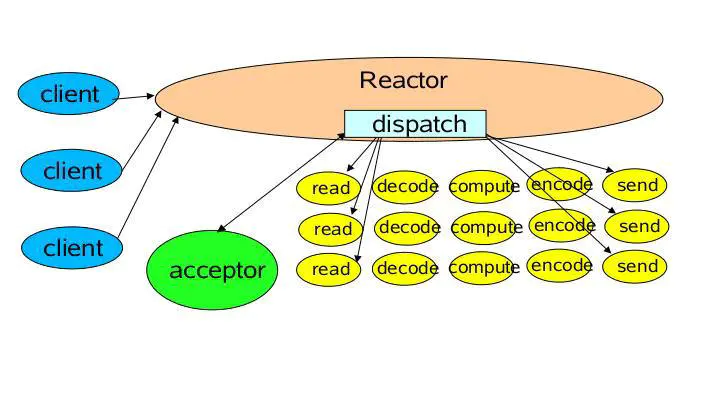
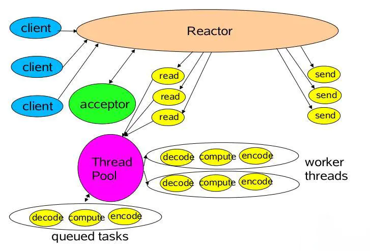

## linux命令
**参考文章：微信公众号 武哥聊编程**
#### linux目录操作命令
- cd 切换目录   如：cd /home
- cd ../ 返回上一级目录
- mkdir 新建目录 如：mkdir newfile
- mkdir -p 创建多级目录，父文件夹不存在则新建 如：mkdir newfile/dir1/dir2
- rmdir 删除空目录 如：rmdir dir2

#### linux文件操作命令
- touch 新建空文件 如：touch 1.txt，touch 2.java
- mv 移动文件或目录 如：mv 1.txt moved.txt（文件改名）, mv 1.txt /home/1.txt
- rm 删除文件 如：rm 1.txt
- rm -r 删除目录，同时删除该目录下所有文件，删除每个文件都有询问
- rm -f 强制删除，没有询问
- cp 复制文件或目录
- cp -r 递归复制，将目录下的文件夹中文件一并拷贝

#### linux文本显示命令
- cat 显示文本全部内容 如：cat 2.txt
- more 分页显示，可前后翻页，空格向后，b向前 如：more 1.txt
- less 分页显示，可前后翻页，上下键翻滚，支持底行模式 如：less 1.txt
- head 文档开头，默认前十行
- tail 文档结尾，默认后十行  
  通过tail -f 可以动态刷新文件尾部的新添加内容
- wc 统计文本行数，字数，字符数

#### linux查找命令
- find 在当前目录下查找文件或目录 如：find 1.txt
- find -name 查找文件或目录 如：find -name 1.txt
- find [dir] -name [name] 在指定文件夹下查找文件 如：find /home -name 1.txt
- grep 在指定文件中查找有指定内容的行 如：grep asd 1.txt

#### linux进程
- ps -e 查看所有进程
- ps -f 查看进程详细信息 如：ps -ef
- ps -a 查看用户所有进程
- ps -u 按用户名和启动时间顺序来显示进程 如：ps -au
- ps -x 显示无控制中断的进程 如：ps -aux
- top 显示cpu资源占用较高的进程
- kill 杀死进程 如：kill [pid]
- kill -9 [pid] 强制杀死进程

## linux文件压缩解压
- gzip 压缩文件 如：gzip 1.txt  
- gzip -d 解压文件 如：gzip -d 1.txt.gz  
- tar -c 建立一个压缩文件  
- tar -x 建立一个解压文件  
- tar -f 指定压制的文件或需要解压的文件 如：（压缩）tar -cf 1.txt.tar 1.txt, （解压）tar -xf 1.txt.tar
- tar -z 是否使用gzip压缩，使用后后缀为 1.tar.gz  

#### linux文件权限操作
- ll 在目录下执行ll，显示目录下文件和文件夹的详细信息，其中包含权限  
**文件权限描述符格式：**  
描述符形如：-rwxr--r--  
其中(-文件类型)(rwx文件所属用户权限)(r--所属组权限)(r--其他用户权限)  
r表示可读，w表示可写，x表示可执行，对应位置为“-”表示不允许该操作  
 
- chmod ugo+r [name] 权限增加或减少 如： chmod u+r 1.txt  
u表示所属用户，g表示用户组，o表示其他用户，+表示加权限，-表示减权限，rwx分别对应相关权限
- chmod xxx [name] 通过三维数字，将权限统一修改 如：chmod 721 1.txt，7对应二进制(111),表示rwx, 2对
应(010)，表示-w-  
- chown 修改文件用户组 如：chown ahou:ahouGroup 1.txt表示文件1.txt用户组ahouGroup，所属用户ahou  

#### linux 查看进程的cpu使用情况
- 可以通过 ps -ef | grep [process name] 来查找线程id，获得通过top命令查看，或者通过ps -a查看用户进程  
- 获取进程id后，调用top -p [process id] 即可  
例如输入top后，会有一个top进程，通过 ps -ef|grep top可看到进程id，如5981  
然后调用top -p 5981即可查看进程cpu使用率  

ps和top命令默认查看的是进程情况，可以通过命令参数切换到线程查看，ps 中通过 -T，top通过 -H  

#### linux查看多核cpu使用情况
- 输入top命令，按1即可显示多个cpu的使用情况

#### linux下查看TCP状态
- netstat -napt 命令

#### linux下查看磁盘状态
**参考文章：[article1](https://www.cnblogs.com/flyingeagle/articles/9219106.html)，[article2](http://c.biancheng.net/view/6212.html)，[article3](http://c.biancheng.net/view/6287.html)**  

- df，统计磁盘整体情况，包括已使用，可使用等信息  
- sar，sar命令可以全面查看系统cpu，内存，磁盘读写等多种数据，是分析系统性能的重要工具  
- sar -d 3 5，输出磁盘的读写情况，每3秒统计一次，统计5次  
- iostat -d 2 3，查看硬盘的读写情况，每2秒统计一次，统计3次  

#### linux关机重启
- shutdown -r 先关机，后重启
- shutdown -h 关机不重启
- halt 关机，关闭电源
- reboot 重启 相当于shutdown -r

#### linux sed进行字符串替换
- sed 's/原字符串/新字符串/' file 将文件中第一个原字符串替换为新字符串，如 sed 's/string/newString/' text.txt
- sed 's/原字符串/新字符串/g' file 将文件中所有原字符串替换为新字符串，如 sed 's/string/newString/g' text.txt  
**支持原字符串中内容为正则表达式**

- sed '行号c 新字符串' file 将文件中指定行内容替换为新字符串，如 sed '2c new text' text.txt
- sed '行号1，行号2c 新字符串' file 将文件中行1到行2所有内容替换为新字符串，如 sed '2c new text' text.txt

- sed -e 命令1 -e 命令2 file 通过-e将多个命令连接起来按序执行
- sed -i 命令 将替换结果保存到文件中，如 sed -i 's/string/newString/g' text.txt

## Reactor模型
**参考文章：[article1](https://www.jianshu.com/p/1a7005768e16)， [article2](https://www.jianshu.com/p/e108ecd76924)**  
Reactor是一种事件驱动的网络模型，为事件注册回调函数，实现任务处理，主要的三个组件有：
- 多路复用器  
由操作系统提供，比如linux中的select，poll，epoll，实现IO的多路复用
- 事件分发器  
将多路复用器中返回的事件分发到对应的处理器中去
- 事件处理器  
对于特定的事件做处理  

Reactor的请求处理流程：
- 应用程序注册读就绪或写就绪事件和相关的事件处理器
- 事件分发器等待事件发生
- 将发生的事件分发到对应的处理器

Reactor的几种模式：
- 单reactor单线程模型  
  
单个reactor处理多路套接字分离，accept新的连接，并将事件分发到处理器中，这个处理流程是单线程  
- 单reactor多线程模型     
事件处理器采用线程池实现多线程，handler响应事件，然后将业务处理分发给工作线程
- 主从reactor多线程模型
reactor分为两部分，mainReactor负责监听server socket，建立网络连接，将建立的socketChannel交给subReactor  
subReactor处理已建立连接的事件处理  

## linux epoll原理
**参考文章：[article1](https://www.jianshu.com/p/e6b9481ca754), [article2](https://zhuanlan.zhihu.com/p/56486633)，[article3](https://segmentfault.com/a/1190000003063859)**    
epoll是linux下实现io多路复用的一种方式，是poll/select的增强版本。  
在一个socket中，并不是每时每刻都有数据传送，在没有收到数据时，socket对应的进程读数据会被阻塞，为了高效的实现socket管理，通过多路复用实现一个进程管理多个socket连接  
select的实现中，会每次扫描所有文件列表fd中的socket，检查是否有socket收到数据，然后将收到数据的socket进行处理。在管理过程中，有两次遍历，每次都需要将当前进程加入到socket的等待队列，扫描过程需要遍历，从socket中将进程移出  
因为select不知道哪个socket有数据，所以每次都要遍历查询  
select中维护等待队列和阻塞进程是一体的，每次都要执行一遍  
epoll的实现中，将维护等待队列和阻塞分离开，每次处理socket只会有阻塞，维护则统一进行，不需要主动进行socket的数据监测，该任务由事件中断进行  
epoll中除了维护文件列表外，还维护了一个就绪列表rdllist，其中存放了有事件发生的socket（数据就绪），每次检测rdllist中有无数据，处理即可  

**select:**  
int select (int n, fd_set *readfds, fd_set *writefds, fd_set *exceptfds, struct timeval *timeout);  
每次调用都要传入需要监听的文件描述符，可以传入的fd有最大数量限制（1024），这个过程涉及用户态到内核态的转换，当发生事件后select方法返回，还需要遍历传入的描述符判断哪些发生了事件

**poll:**
int poll (struct pollfd *fds, unsigned int nfds, int timeout);  
与select相比，传入文件描述符的方式有所不同，不再通过位图的方式传入fd，而是通过链表传入，这样避免了最大数量的限制，但仍然存在select中的问题，即每次都涉及用户态到内核态的转换，返回后需要遍历判断哪些fd发生了事件

**epoll:**  
int epoll_create(int size)；//创建一个epoll的句柄，size用来告诉内核这个监听的数目一共有多大  
int epoll_ctl(int epfd, int op, int fd, struct epoll_event *event)；  
int epoll_wait(int epfd, struct epoll_event * events, int maxevents, int timeout)  
通过epoll_create创建epoll句柄，然后调用ctl方法传入要监听的fd和事件，在处理时调用wait来获取发生事件的fd，不同于select和poll的是，这里只会返回发生了事件的fd，不需要遍历判断，并且通过ctl方法将fd传入内核态后是常驻的，不会每次调用wait都转换，wait返回时仅将发生事件的fd从内核态转到用户态  

**select，poll和epoll支持的fd数量限制：**  
首先受制于进程文件描述符和硬件的限制，一般它们的fd数目都会存在限制，但是在实现上，select会通过FD_SETSIZE限制最大fd的数目，默认是1024，它的实现类似bitmap，而对于poll和epoll，由于通过数组或链表来存储节点，不存在实现上的fd限制，但依然会受到进程fd的限制  
另外在实现方式上，因为select和poll需要扫描所有fd确定ready的连接，处理大量fd时的性能不高，不适合大量fd的情况  

**epoll和select区别：**  
它们都是操作fd（file discriptor）来判断可以操作的socket  
- epoll中fd是常驻在内核中的，只有fd中socket发生检测事件后，才传递到用户态进行可读写fd的处理  
- 在select中，每次检测都要将所有fd进行**用户态到内核态(未确认)**的复制  
- 在使用时，epoll只使用fd的子集，select需要使用整个fd  

**epoll工作流程：**  
- 创建epoll对象  
在进程中调用epoll_create方法，会创建一个eventpoll对象
- 维护监视队列  
创建epoll对象后，调用epoll_ctl方法添加和删除socket，添加后会将eventpoll添加到socket的等待队列中  
socket收到数据后，中断程序会操作eventpoll对象，而不是进程
- socket接受数据  
socket接收到数据后，中断程序会将socket添加到eventpoll的rdllist就绪列表中  
**eventpoll相当于进程与socket中间的媒介**  
- 执行epoll_wait  
执行epoll_wait方法后，会检查rdllist，有至少一个socket引用则立即返回，rdllist为空则阻塞  

**epoll中的数据结构：**  
- 就绪列表rdllist  
rdllist中包含就绪的socket，它应当能够进行高效的插入，eventpoll中使用双向链表实现rdllist
- 监视列表  
epoll中维护了监视列表实现socket的关联，调用epoll_ctl进行插入和删除，该表应该能高效的搜索来实现删除，方便添加。  
epoll中通过红黑树来实现socket的索引，红黑树是自平衡二叉树，能够实现高效的查找。  

**其中双向链表和红黑树中并非直接引用socket，而是以epitem作为节点，在epitem中包含了socket**  

**epoll的ET和LT：**  
**参考文章：[article1](http://blog.chinaunix.net/uid-28541347-id-4273856.html)，[article2](https://blog.csdn.net/eyucham/article/details/86502117)**  
ET是边沿触发Edge Trigger,LT是水平触发Level Trigger  
在ET下，当socket接收到数据，缓冲区由空到有数据时，会发生一次触发，将对应fd移到rdllist中，但是如果一次读取没有读取到全部数据，不会发生再次触发，下次调用epoll_wait时不会有这个fd，造成数据只能在下次socket接收到数据后才能读取  
在LT下，当socket接收到数据，缓冲区由空到有数据时，会发生触发，将对应fd移到rdllist中，如果一次读取没有将缓冲区数据读取完毕，仍然会发生触发，通过回调函数将fd加入到rellist中，再次调用epoll_wait仍然会返回这个fd  

**要解决ET模式的问题，需要满足:**  
- 读操作中，buffer中有数据就一直读  
- 写操作中，buffer有空间且用户数据未写完就一直写  
- ET要在非阻塞模式下工作，ET要保证读取全部数据，读取数组要大于buffer中数据，在阻塞模式下，buffer为空却没读到足够数据时会被阻塞，其实本次数据已读取完毕，应设置为非阻塞模式，buffer为空就返回  

- ET是更高效率的触发方式，但是其使用需要更多的操作，保证在一次触发后执行完读写操作
- LT由于会发生更多地回调操作，效率低于ET，但执行会更安全，要求代码编写要求低
 
 ## 进程和线程
#### 进程和线程间的通信方式
**参考文章：[article1](https://blog.csdn.net/pengzhisen123/article/details/79455742), [article2](https://blog.csdn.net/qingtian211/article/details/81558736?utm_medium=distribute.pc_aggpage_search_result.none-task-blog-2~all~first_rank_v2~rank_v25-2-81558736.nonecase&utm_term=%E4%B8%A4%E4%B8%AA%E8%BF%9B%E7%A8%8B%E9%97%B4%E5%8F%AF%E4%BB%A5%E5%85%B1%E4%BA%AB%E5%86%85%E5%AD%98%E5%90%97)**  
**线程间的通信：** 
- 管道
- 共享对象
- 消息队列
- 套接字
- wait(),notify(),notifyAll()方法和synchronized，volatile关键字

**进程间的通信方式：**  
- 管道  
- 信号量  
信号量是一个计数器，多用于控制多个进程对共享资源的访问，实现一种锁机制
- 信号  
- 消息队列  
- 共享内存  
数据存取速度快，但不支持同步，需要借助信号量或其他的通信机制实现安全访问
- 套接字  
可以在不同机器的不同进程间通信，灵活，传递数据量大

#### 共享内存的实现方式
**[article1](https://blog.csdn.net/a1912157861/article/details/122918087)**  
共享内存是比较方便且性能较好的进程间通信方式，该通信是通过将多个进程的虚拟地址空间映射到同一块物理内存空间来实现的，每个进程都有自己的虚拟地址空间，映射到实际的物理地址，并且正常不同进程的虚拟地址不会映射到相同的虚拟地址空间，为了实现不同进程的通信，可以在不同进程中将部分虚拟地址映射到相同的物理地址中，通过读写同样的物理内存来实现通信，**但共享内存不支持同步，需要借助信号量或其他的通信机制实现安全访问**  

## linux进程调度
**参考文章：[article1](https://blog.csdn.net/skypeng57/article/details/85273185)，[article2](https://www.cnblogs.com/sky-heaven/p/8118110.html)**  

当linux中存在大量进程时，优秀的进程调度方法可以更好的利用系统资源。  
linux进程分为两种级别：**实时进程**和**普通进程**  
一般的优先级是当实时进程可执行时，普通进程没有执行机会，当高优先级的实时进程可执行时，
低优先级的实时进程没有执行机会，但也可以配置实时进程的最长执行时间，到达时间后，普通进程获得执行机会

#### 实时进程的调度
实时的原本含义是保证在给定时间内执行完成(硬实时)，但这种实时在操作系统中很难完全保证，所以这里的实时
是尽可能的保证任务的执行(软实时)  
实时进程会被设定静态优先级，不会被改变
**实时进程的调度：**  
- 当有多个进程处于可执行状态时，优先执行优先级高的进程，直到它变为不可执行状态
- 当多个进程具有相同的优先级时，有两种调度策略可供选择
    - SCHED-FIFO，先进先出，根据队列顺序，前面的进程变为不可执行后，再执行接下来的进程
    - SCHED-RR, 轮询，给进程分配时间片，当进程时间片用完时切换下一个进程执行

#### 普通进程的调度
当实时进程都不可执行时，会进行普通进程的调度，普通进程是动态优先级，会从静态优先级开始动态调整  
**采用动态优先级的原因：**  
不同进程对于反应时间有不同的要求，一般交互式进程要求反应快，应该设定较高优先级，而计算型进程不要求较快的反应时间，优先级可以低一些，但给每个进程判定类型和设定优先级是繁琐的，并且进程的类型不是一成不变的
通过进程执行情况动态调整优先级是更好的选择。

**普通进程的调度方式：**  
- 给可执行进程分配时间片，进程用完时间片后放入过期队列，等可执行进程都过期了再分派时间片执行
- 随着进程在cpu中的执行时间变长，它的优先级会逐渐降低

#### 进程调度效率
- 在linux2.4时，所有进程都挂在一个链表中，每次需要扫描整个链表确定优先级最高的进程，时间复杂度O(N)
- 在linux2.6早期，可执行状态的进程被挂载到N（N=140）个链表中,每个链表对应一个优先级别，调度时只需要从第一个
不为空的链表中取出第一个元素，时间复杂度O(1)
- 在linux2.6近期版本中，采用红黑树存储进程，按优先级排序，调度的时间复杂度为O(NlogN)

**使用红黑树后，时间复杂度增加了，但优先级别可以随意设置，不像linux2.6早期中只能支持整数且有限个优先级别**

#### 进程调度触发的时机
- 当前进程变为不可执行状态  
进程由于sleep或者等待IO等变成不可执行状态
- 抢占
当前进程的时间片执行完毕，被更高优先级的进程抢占

#### 进程调度算法
**参考文章：[article](https://www.cnblogs.com/alantu2018/p/8460451.html)**
- FCFS，先来先服务，根据进程到达时间进行调度
- RR，轮转，为进程分配时间片，对FIFO队列中的进程轮转调度，时间片执行完毕放回队列尾部
- 多级反馈优先调度算法，优先执行优先级高的进程，相同优先级采用RR调度
- 短作业优先调度算法SJF，优先调度估计执行时间短的进程
- 高响应比优先调度算法，响应比=(服务时间+等待时间)/服务时间，优先调度响应比高的进程，
随着等待时间的增长，响应比会增大。相同等待时间的情况下，服务时间段的短任务会被优先调度

**CFS完全公平进程调度算法：**  
**参考文章：[article1](https://blog.csdn.net/qq_31098037/article/details/78125893)，[article2](http://www.elecfans.com/emb/20190402899193.html)**  
CFS调度算法保证进程的执行时间跟它们的优先级成比例  
在调度时，CFS根据各进程的vruntime作为参考，选择虚拟时间最小的进程进行调度，而虚拟时间的增长速度
并不相同，与进程的权重相关，权重大的进程虚拟时间增长速度慢，保证被分配到更多的执行时间。  
进程的vruntime = 实际执行时间*常数/进程权重  

## 虚拟内存
**参考文献：[深入理解虚拟内存机制](https://www.jianshu.com/p/13e337312651)**  

### 大端与小端模式
**参考文章：[article](https://blog.csdn.net/iteye_21199/article/details/82205638?spm=1001.2101.3001.6661.1&utm_medium=distribute.pc_relevant_t0.none-task-blog-2%7Edefault%7ECTRLIST%7Edefault-1-82205638-blog-107770703.pc_relevant_default&depth_1-utm_source=distribute.pc_relevant_t0.none-task-blog-2%7Edefault%7ECTRLIST%7Edefault-1-82205638-blog-107770703.pc_relevant_default&utm_relevant_index=1)**  
大小端指数据在内存中存储时的对齐方式，大端模式下，数据的高位存储在内存中的低位，数据的低位存储在内存中的高位，如从0x4000地址开始存放数据0x1234,大小端的存放数据如下    
| 内存地址 | 小端模式存放内容 | 大端模式存放内容 |
| -------- | ---------------- | ---------------- |
| 0x4000   | 0x34             | 0x12             |
| 0x4001   | 0x12             | 0x34             |
大小端的区别如下  
- 大端模式下，可以方便的从内存低位获取数据的正负号
- 小端模式下，在强制数据类型转换时可以直接扩充或者截断，不需要重新构建数据
