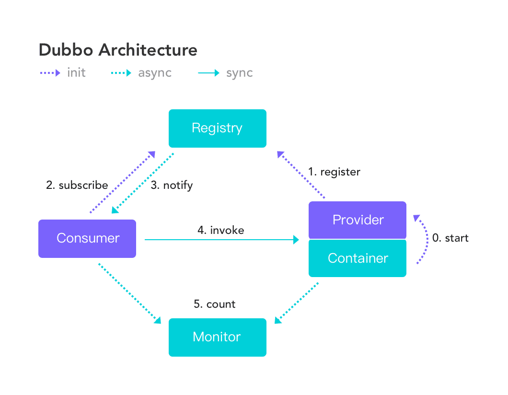

# dubbo

dubbo是一款基于Java开发的高性能RPC框架，  

**[dubbo开源项目地址](https://github.com/apache/dubbo)， [dubbo用户手册](https://dubbo.gitbooks.io/dubbo-user-book/)**  
  

**dubbo的主要功能有三点：**
- 基于RPC的透明接口调用
- 负载均衡
- 自动服务注册与发现
 
## 