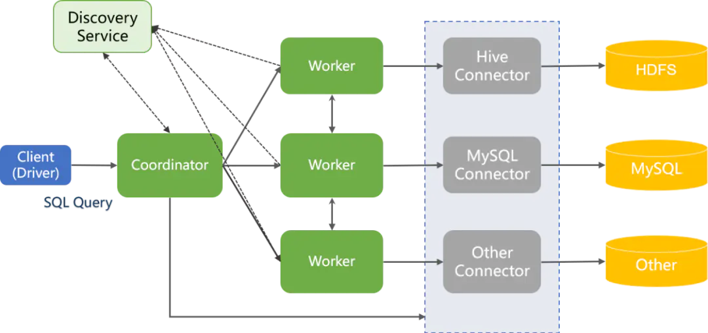

## LevelDB

## RocksDB

## Presto

**[My PR to fix ui bug](https://github.com/prestodb/presto/pull/17329)**

**参考文章：[presto document](https://prestodb.io/docs/current/index.html)，[article1](https://www.cnblogs.com/pengpenghuhu/p/14279868.html)**  

presto 是一个开源分布式的sql查询引擎，数据量支持GB到TB字节，presto本身不存数据，但是可以接入很多数据源如oracl、mysql、hive、kafka、mongodb、redis，而且支持跨数据源的级联查询。

### Presto架构

Presto集群分为client、coordinator、worker、discovery service几部分，presto集群中有一个coordinator节点，一个discovery service节点和多个worker节点  
- client
向coordinator发起sql查询并接收结果，client可以通过presto cli、jdbc等发起查询  
- coordinator
集群的master节点，负责接受客户端查询，对sql进行解析，生成执行计划并将任务调度到worker节点来执行，对结果进行合并并返回给client  
- discover service
负责集群的状态管理，worker节点启动后向discover service注册自己，coordinator从discovery service中拉取当前工作的worker节点  
- worker
负责数据的读写交互，执行查询计划  



### Presto高性能原理
- 完全基于内存的并行计算
- 流水线计算，结果流水线式返回给client
- 本地化计算，优先分配task给跟数据同host或者同机架的worker节点
- 动态编译执行计划
- GC控制

### Presto查询流程
**参考文章：[article1](https://blog.csdn.net/qq_42511550/article/details/119490317)，[article2](https://www.jianshu.com/p/b1543299770d)**  
- client通过http向presto集群的coordinator节点发起sql查询
- coordinator接收到sql statement后，对sql进行词法和语法解析生成抽象语法树（antlr4），然后生成逻辑执行计划，将执行计划转化为stage和task，然后将task调度到work节点执行
- worker通过connector从数据源读取数据并进行处理和传输
- 下游stage的worker接收上游节点的数据，继续执行本阶段的计算
source stage进行查询时，会通过索引下推尽量减少从数据源中拉取的数据量  
- coordinator调度执行任务后，就会一直从worker节点中拉取计算结果并进行合并汇总，缓存起来
- client在发起查询后也会不断从coordinator中拉取数据，每次拉取到一部分就显示一部分

### Presto和Hive
hive是基于hadoop的大数据查询引擎，hive将sql转化为Map-Reduce任务，然后基于hdfs中的数据进行处理，其实质是MR任务，查询性能也受MR本身的一些制约，比如中间结果会先存入磁盘，前后的任务顺序执行，reduce需要等待map任务未执行结束并shuffle    

Presto是基于内存的MPP（massively parallel processing）架构查询引擎，计算是流水线式的，coordinator拿到结果后会流式的传输给客户端，不需要数据完全处理完毕再返回，同时coordinator在分配split给work节点时会尽量实现本地化，优先分配给跟数据源同host或者同机架的worker  

### presto resource group

#### presto resource group 介绍
presto资源组用于对不同分组的查询进行一定程度的资源隔离，用于限制查询的资源使用，presto会根据查询类型、用户和标签将查询路由到不同的group，而不同的group具有一定的资源限制，如并发查询数，允许使用的内存、cpu时间等资源，还有最大排队查询数，超过限制后查询将进行排队，队列满后将拒绝查询，通过这些限制，保证集群中不同查询的资源使用更加合理，避免资源挤占  

资源组可以划分为多个子组，也可用于接受查询，但不能同时接受查询和划分子组  

资源组主要对正在执行的查询数，排队的查询数，查询使用的内存和cpu时间进行管控，配置的主要参数有：  
- hardConcurrencyLimit  资源组中同时执行的查询最大数量，超过该值后查询进行排队
- max_queued  资源组排队查询的最大数量，超过该值后将拒绝查询
- soft_cpu_limit 资源组中查询在一个周期内所能使用的cpu时间，超过该值后将线性降低资源组的查询并发数
- hard_cpu_limit  资源组查询的cpu时间限制，与soft_cpu_limit配合使用，当cpu时间占用超过该值时，并发降为1，并拒绝新的查询  
- softMemoryLimit 资源组允许使用的内存大小，标注为soft是因为这里是在提交查询时监测，达到阈值后限制之后的查询，但已提交的查询还是可能造成group使用的内存超过这个值，所以它不是严格的限制  
- scheduling_policy 资源组的调度策略，当多个子组同时有查询排队时，根据该策略决定谁先调度执行，有基于优先级、权重、先入先出等多种策略  

#### resource group配置接入
- 接入方式  
presto的配置接入支持file和db两种方式，通过在etc/resource-groups.properties中配置相关属性来设置  

- 配置加载  
presto通过插件的方式加载file和db的配置管理工厂类ResourceGroupConfigurationManagerFactory，工厂类用于创建资源组的配置管理器ResourceConfigurationManager  

#### 在基于db的配置下，对配置加载的过程进行梳理

基于db的配置加载由DbResourceGroupConfigurationManager类来进行  

1、在实例化对象时通过配置的jdbc来进行资源组建表，主要包含三个表  

ResourceGroupsGlobalProperties  全局信息表，定义资源组全局信息，当前只用到一个属性cpu_quota_period，用于设定cpu时间额度赋予的周期  

ResourceGroups 资源组定义表，定义资源组及其继承关系，配置各资源组的资源和并发限制
Selectors  选择器表，定义通过user、source等信息来路由查询到资源组的规则  

2、定时进行资源组内容的加载  
通过定时线程每10s进行db中配置加载更新  
拉取库中的资源组信息，构建资源组对象和各级资源组之间的包含关系  
拉取selectors中的信息，构建selector对象  
与管理器中当前的资源组配置对比，得到更新和删除的资源组，进行配置更新和逻辑删除(该资源组的并发和排队值设为0)  

#### resource group资源管理
资源组中设定了组内查询的最大并发数、内存使用限制、cpu时间限制，下面梳理在presto的查询中，资源组的资源管理是在查询的哪个阶段生效的，以及如何实现组内使用的查询资源的管理  

presto收到statement查询后，会创建一个Query对象，后由dispatchManager对该Query的sql、session信息进行解析（之后生成DispatchQuery对象）  

- 通过session中的user、source、client_tag等信息匹配得到对应的资源组  

- 执行资源组的run方法，对资源组的使用情况进行判断，来决定该查询的后续执行，逻辑如下 
	- 判断是否叶子节点，只有是叶子节点的资源组可以进行分配查询  
	- 从该资源组向上遍历其父资源组，依次判断对应资源组  
       是否可排队，检查是否达到最大排队查询限制maxQueuedQueries  
       是否可执行，这里需要检查的逻辑如下：  
	   
			1.  是否超过cpu时间限制hardCpuLimitMillis，  

			2). 是否超过task执行限制（presto全局配置，当前的task数超过限制后不能执行新的查询，这里的task是实际在work上执行的并行任务）  

			3). 是否超过cpu时间限制softCpuLimitMillis，超过则按比例减少并发执行的查询量hardConcurrencyLimit，到达hardCpuLimitMillis后会降到最小为1  

			4). 当前执行查询数是否超过hardConcurrencyLimit  

			5). 缓存内存使用是否超过soft内存限制softMemoryLimitBytes  

		不可排队且不可执行，查询失败  
		可执行，父资源组的runningQueries依次自增，继续执行查询  
		不可执行则进行排队，加入排队队列    

这部分在进行判断过程中，需要一些资源组当前状态数据来进行判断，其中正在执行和排队的查询通过队列存储，可以方便的获取数值来判断是否超过限制  

对于所使用的cpu时间和内存，主要通过查询的stateMachine来获取，其中记录查询执行过程中的资源使用和各种数据，资源组的cpu时间和内存数据更新方式：  
``` javascript
	- 通过对查询的结束事件进行监听，查询结束时通过状态机获取查询的cpu time 累加到资源组所应用的总时间里    
	- 资源组管理器执行后会开启定时任务，每毫秒进行资源组（从根资源组开始遍历整个树）使用内存的大小更新（数据从查询状态机获取）等操作    
```

- 资源组中会通过定时任务进行排队查询的调度，根据不同的调度策略维护对应的队列类型，当可执行查询时，从队列选择排队的查询进行调度执行

### presto resource group 源码阅读笔记
Query中调用waitForDispatched进行dispatchManager.createQuery操作，
其中DispatchManager类createQueryInternal方法通过session中的use、source、client_tags、query_type信息选择资源组
然后通过资源组管理类

InternalResourceGroupManager
向该类执行submit提交查询
ManagedQueryExecution
到对应的资源组
InternalResourceGroup对象
执行run方法进行资源组下的查询执行
1、判断是否叶子节点，只有是叶子节点的资源组可以进行查询
2、从该资源组向上遍历其父资源组，依次判断对应资源组是否可排队（queue限制maxQueuedQueries，超过则拒绝），
是否可执行（1.是否超过cpu时间限制hardCpuLimitMillis，超过则拒绝，2.是否超过task执行限制，超过则拒绝，3.是否超过cpu时间限制softCpuLimitMillis，按比例减少并发执行的查询限制hardConcurrencyLimit，
到达hardCpuLimitMillis后会降到最小为1，4.当前执行查询是否超过新确定的hardConcurrencyLimit，超过则拒绝，缓存内存使用是否超过soft内存限制softMemoryLimitBytes，超过则拒绝
）
3、不可排队且不可执行，查询失败
4、可执行，则依次给父资源组的runningQueries加一，继续执行查询
5、不可执行则进行排队，加入排队队列（同时设定其优先级参数值）


QueryStateMachine查询状态机，会记录查询的执行时间，对查询注册结束的监听事件，查询结束时通过该状态机获取查询的cpu time 累加到资源组里
InternalResourceGroupManager执行start方法后，会开启定时任务，每毫秒（上一次结束和下一次开始间隔1ms）进行资源组（从根资源组开始遍历整个树）cpu时间额度的更新，使用内存的大小更新（数据从查询状态机获取）等操作

ExactMatchSelector 配置通过source和queryType到resource group的精确匹配

selectors中可配置ResourceEstimates  若查询session中包含的执行时间，cpu时间和peakMemory在指定的范围内，则匹配对应selector

查询类型
DATA_DEFINITION,
DELETE,
DESCRIBE,
EXPLAIN,
ANALYZE,
INSERT,
SELECT


pluginManager中会加载资源组管理器工厂类，包括file和db类型的  


PrestoServer启动执行run方法时通过  
ResourceGroupManager.loadConfigurationManager加载资源管理器工厂类，方法中通过配置文件的
resource-groups.configuration-manager属性决定使用基于file还是db的资源组管理器
对应的资源组管理器ResourceGroupConfigurationManager此时进行实例化
在构造方法中db管理器会执行建表和数据加载工作，加载定义的资源组、selector等数据，此后每间隔10s进行一次数据加载操作  


softConcurrencyLimit的用处：  
若资源组的当前查询数大于soft并发限制，资源组使用实际权重。否则乘以一个极大值Integer.MAX_VALUE，使没有达到softlimit的资源组权重是极大值，在排队查询的调度中优先调度
该参数没配置时默认设为hardConcurrencyLimit


排队查询的调度逻辑
设定资源组的调度策略后，会重新构建队列
设定调度权重后，会重新构建队列
定时任务会执行的processQueuedQueries中会执行internalStartNext来调度排队的查询，其中取出一个subGroup调度后，若其中还有查询排队，会再将它加入队列

### presto client查询源码学习
查询在coordinator端的执行流程

客户端通过/v1/statement 提交请求

处理方法 QueuedStatementResource.postStatement

生成Query对象，通过getInitialQueryResults返回nextUrl = /v1/statement/queued

客户端调用 /v1/statement/queued获取查询状态

处理方法 QueuedStatementResource.getStatus
dispatchManager对请求进行分发处理，通过query.waitForResults获取查询结果
查询结果，nextUrl=/v1/statement/executing

dispatchManager中会创建query并在createQueryInternal中preparedQuery，（sqlParse）进行sql的词法和语法分析


客户端继续调用/v1/statement/executing获取查询结果
处理方法ExecutingStatementResource.getQueryResults
通过query.waitForResults获取查询结果，查询结果多次拉取token递增
