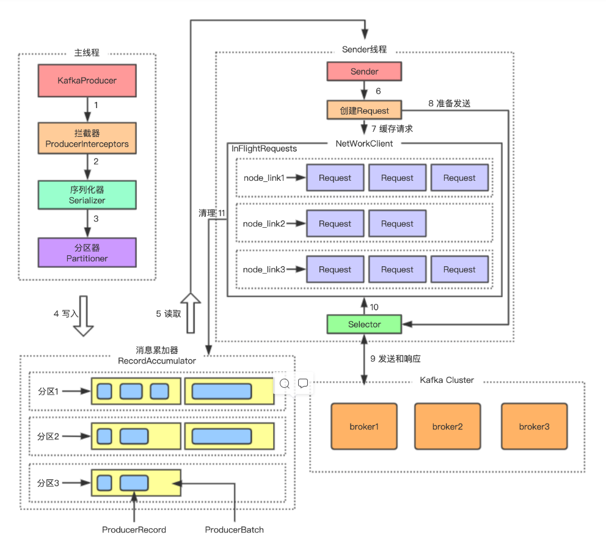

## LevelDB
**参考文章：[LevelDB handbook](https://leveldb-handbook.readthedocs.io/zh/latest/rwopt.html#section-2)**  

### 写入与compaction
在LSM实现下，LevelDB具有非常好的写性能，其写入涉及的磁盘操作包括日志WAL的写入和sst文件的写入，这两种写入均是顺序操作，极大的利用了磁盘顺序写入性能高的特性  

#### 数据写入
- WAL
LevelDB在把文件写入memtable前会先进行日志记录，将操作追加写入到WAL（write ahead log）中，用作数据的崩溃恢复，每一个memtable都对应一个log文件，若memtable持久化之前服务宕机，在db实例启动时会利用log文件重构memtable数据  
当memtable持久化为sst文件之后，对应的log文件会被删除  
数据在WAL文件中以block的格式存储  

- memtable  
LevelDB的数据写入和存储涉及内存中的memtable和磁盘中的sstable，memtable是通过跳表实现的，当用户写入数据时会插入到memtable中，当memtable超过指定大小时转换为只读的immutable memtable，同时levelDB的compaction线程会对内存中只读的immutable memtable进行落盘，转化为磁盘中的sst文件，存储LSM树的L0层  

**写入合并：**  
在并发写入时，leveldb会通过合并写入来优化性能，当写入线程获取写锁后，做写入数据未超过批量写入的阈值，会检测是否有等待写入的数据，如果有则会进行合并后再写入  

**写入的原子性：**  
leveldb通过日志来实现写入的原子性  
- 写入log过程中异常退出
db启动时检测到数据错误，会丢弃该数据，该写入对数据库不生效  
- log写入完成，未写入memtable或者memtable未持久化时发生时异常退出
数据库启动时会从log中恢复memtable，保证数据正常写入  

#### 数据compaction
LevelDB的compaction操作有两种，一种为immutable memtable compaction为L0层的sst文件，另一种为L0-Ln-1层之间sst文件的compaction，其中memtable的compaction操作有更高的优先级，因为memtable位于内存中，若没有及时的持久化到磁盘，可能会堵塞写入操作。  

**compaction操作的原因：**  
- 数据持久化  
内存中的memetable通过compaction为sst文件来完成数据的持久化，memtable达到预定大小后会被转化为sst文件的格式直接放入L0层  
- 提高读取效率  
若只有memetable的compaction，那所有的sst文件都会位于L0层，并且这些文件中存在overlap，在查找时需要访问多个sst文件，甚至需要访问到大部分文件（对于随机写入，sst文件的范围有可能会非常大，sst几乎不可避免的会出现overlap），此时查找性能会极差，所以leveldb要求L0层的文件会有个数限制（默认4），将sst存储在多层中且L1-Ln层的sst文件之间不存在overlap，L1到Ln层允许存放的数据是10倍的递增（10M， 100M， 1000M，...），通过compaction将文件下沉，这样每次查找最多只需要访问L0层的4个文件和其他层最多一个文件  
- 优化数据存储
由于LevelDB的写入都是追加操作，在存储的文件中同一个key会存在多份数据，compaction时会仅保留最新的，优化存储占用  

#### compaction操作过程

当L0层的sst文件个数超过阈值，或者L1-Ln-1层的文件大小超过阈值就有可能触发compaction  
- 选择层
LevelDB会对每一层进行打分，作为compaction选择某一层的参考，打分规则为  
	``` javascript
	L0：当前层文件数/文件数阈值
	L1-Ln-1:  当前层文件总大小/当前层文件大小阈值
	```
	可见当分数大于1时表明该层需要进行compaction，db会选择分数最高的层进行compaction  

- 选择sst
db中会维护每一层上一次compaction文件的最大key，在进行下一次compaction时选择该Li层第一个最小key大于该值的sst文件作为发起compaction的文件sst（效果是compaction会在该层依序选择文件），然后根据该文件的key范围确定Li+1层中跟该sst存在overlop的sst，确定这些文件后，会根据合并后的key范围，检测是否又跟Li层的文件有overlap，在确认加入这些文件不会扩大Li+1层sst的情况下，将这些文件也加入compaction的源文件中  

- compaction操作
sst的compaction操作本身是一个多路归并的过程，归并过程在Li-1层生成一个或多个新的sst文件，结束后将旧的sst文件删除  

**另一种compaction触发条件：**  
上面的compaction操作有可能会出现级联触发，L0 compaction到L1后又触发了L1的compaction，这样会造成db的i/o占用比较高，影响db的性能  
leveldb采取了一个缓解的方法是进行错峰合并，对查找多次不命中（每次查找的第一个sst若未命中，则进行计数减1）的文件触发compaction，这种compaction可能出现在每一层，错峰合并一定程度上降低了compaction级联触发的可能性  

### SSTable结构
**参考文章：[article](https://leveldb-handbook.readthedocs.io/zh/latest/sstable.html)**  
sst文件的设计是保证LevelDB查询性能的关键  
sst文件中数据是按block存储的，每个block默认大小为4KB  ，sst中数据的存储顺序依序是：  
- data block  
块中存储实际kv数据，每个块包含数据体、压缩类型，crc校验数据    
数据体中按序存储kv数据组成的entry，其中每隔restartInterval（默认16）个entry会出现一个restart point，restart point会存储完整的kv数据，他们间隔中的kv会进行前缀压缩，仅存储跟上一个key不相同的部分，因此每个entry中需要记录跟上一个key共享的字符串长度，不共享的字符串长度，然后是不共享的key内容，最后是value长度和内容    
每个data block还会记录每一个restart point的offset和restart point个数，在对data block进行扫描时通过restart point可以先进行二分搜索确定区间后再顺序查找  
- filter block
存储bloom过滤器数据，每隔一定长度的key会生成一个bloom过滤器，filter block中除了依序存储filter的数据，还会存储filter的offset，便于定位数据位置  
- meta Index block
只存储一条记录，key为"filter."与过滤器名字组成的常量字符串，value为filter block的offset和length  
- index block
存储data block的索引，key为block中最大的key与下一个block最小key的最短分隔字符串（为了减少key的空间占用），value为对应block的offset和length  
- foot
存储魔数和index block、meta Index block的offset、length  

**一个sst中仅有一个filter block和一个index block**  

### 读取与缓存

#### 读取过程
LevelDB的读取过程也是根据文件的存储结构来依次查找的，命中即返回  

假设在没有缓存的情况下，key的读取过程：  
- 读内存
从memtable中检索是否存在数据  
- 查找可能的sst
根据manifest中记录的各个level中sst范围进行匹配，从level0开始，依次向下查找，这里L0可能命中多个sst的key区间，但因为L1-Ln-1中不存在overlap，最多只会命中一个sst  
根据leveldb的compaction特点，一个key最新的值一定在最上层的sst文件里，所以一旦找到key即可返回  
- 在sst中查找
在判断key在一个sst的区间内之后将读取sst进行搜索，首先读取sst的index block，确定key所在的block位置及大小，然后根据block的offset确定所属的filter，通过bloom过滤器判断key是否可能在data block中，若判断成功才会真正读取data block数据，data block内部是扫描时通过restart point来实现的二分查找，命中则返回数据  

#### 缓存
Leveldb中使用了一种基于LRUCache的缓存机制，避免每次读取的IO操作，缓存数据为：
- 已打开的sstable文件对象和相关元数据；
- sstable中的dataBlock的内容；

当需要打开一个sst文件时：
- 先判断缓存中是否存在sst文件的句柄，如果不存在则读取sst文件并缓存其index、filter数据
- 若存在则直接读取缓存数据，无需再从磁盘打开文件  

### 序列号与版本控制
#### 序列号
LevelDB的每次写和删除都是作为一个插入操作存储在db里，并且存储时会为每条数据分配一个递增的序列号，这个序列号会随key一起存储在文件里，序列号也是LevelDB支持快照读的方式，新建一个快照时对应记录下当前的sequence id，当进行读取时仅读取小于等于该序列号的数据  

#### 版本
LevelDB中每次compaction操作都会生成一个新的版本，版本对应的信息存储在元数据文件manifest中，该文件中首先存储一个最初版本的快照，然后针对每一次文件变更操作都对应一个record，记录变更中增加和删除的sst文件序号  

**版本记录的作用：**  
- db启动时根据manifest文件中的数据来得到一个初始状态，然后应用后面的变更记录来重放得到之前的db状态的，每次启动时db会生成一个新的manifest文件，将最新的db元数据作为初始快照，避免每次重启都要应用一遍变更记录    
- 实现compaction操作的原子性
若在记录manifest文件时db异常关闭，还未开始compaction，重启时db还是未发生compaction的状态，最后的异常记录会被忽略  
若在compaction操作过程中异常关闭，由于源sst file在操作完成后才会删除，所以数据不会出现确实，此时db启动会恢复到compaction之前的版本，然后删除临时文件，db会再次触发compaction  

**异常处理：**
- 若manifest文件丢失，是否db便不可用
manifest丢失，实例会无法开启，但可以通过leveldb的repairer方法重建数据库，通过扫描所有文件获取序列号，然后将文件都放到L0层，之后通过compaction操作来重建数据库  


## RocksDB
**参考文章：[RocksDB wiki](https://github.com/facebook/rocksdb/wiki/RocksDB-Overview)**  

RocksDB是facebook基于google的LevelDB进行开发的嵌入式KV引擎

### RocksDB与LevelDB的主要区别
**参考文章：[RocksDB wiki](https://github.com/facebook/rocksdb/wiki/Features-Not-in-LevelDB)[article](https://www.zhihu.com/question/351366744/answer/862704911)**  
- Leveldb是单线程执行compaction，Rocksdb可以支持多线程compaction，充分利用多核的特性，加快文件合并的速度，避免文件合并期间引起系统停顿  
- Leveldb只有一个Memtable，若Memtable满了还没有来得及持久化，则会引起系统停顿，Rocksdb可以根据需要开辟多个Memtable
- LevelDB仅支持level compaction，RocksDB还支持universal compaction
- LevelDB仅支持block的布隆过滤，RocksDB支持memtable、sst布隆过滤和前缀过滤
- Leveldb仅支持snappy压缩，RocksDB支持更多的压缩方式，如zlib, lz4, zstd  
- Levledb不支持备份，Rocksdb支持全量和备份
- LevelDB只能获取单个Key，RocksDB支持一次获取多个K-V，还支持Key范围查找
- RocksDB支持compaction filter，在compaction会调用该拦截器，可基于此实现数据过期TTL
- RocksDB自身支持有限的TTL能力，开启DB时可设置DB级别的TTL时间（单位：s），存储数据会以时间戳为value的后缀，仅在compaction时进行过期，未通过compaction过期的数据可被读取到  


读写配置
``` java
//  写入
public SSTWriter(String path) throws RocksDBException {
        log.info("sst writer path: " + path);
        File file = new File(path);
        if (file.exists()) {
            file.delete();
        }
        RocksDB.loadLibrary();


        options.setCreateIfMissing(true)
                // rocksdb jni has no compression.
                // (1) use lz4 to increase decompression speed
                .setCompressionType(CompressionType.LZ4_COMPRESSION)
                // (2) disable prefix filter
                // .useCappedPrefixExtractor(16)
                .setTableFormatConfig(
                        new BlockBasedTableConfig()
                                // (3) set block size = 4KB
                                .setBlockSize(4 << 10)
                                // (4) enable whole key filter for point lookup
                                 .setWholeKeyFiltering(true)
                                // .setEnableIndexCompression(true)
                                .setBlockRestartInterval(16)
                                .setUseDeltaEncoding(true)
                                .setFilterPolicy(new BloomFilter(10, false))
                                .setIndexType(IndexType.kTwoLevelIndexSearch)
                                .setIndexBlockRestartInterval(16)
                                .setPartitionFilters(true)
                                .setDataBlockIndexType(DataBlockIndexType.kDataBlockBinarySearch)
//                                .setDataBlockHashTableUtilRatio(0.75)
                                .setEnableIndexCompression(false)
                                .setFormatVersion(5)
                                .setNoBlockCache(true)
                                .setPinL0FilterAndIndexBlocksInCache(false)
                                .setCacheIndexAndFilterBlocks(false)
                                .setPinTopLevelIndexAndFilter(false));


        sstFileWriter = new SstFileWriter(envOptions, options);
        sstFileWriter.open(path);
        isOpenFlag = true;
    }
	
	//  读取
    public static RocksDB openRocksDB(String path) throws RocksDBException {
        if (globalOption == null) {
            globalOption = new Options().setMaxOpenFiles(ConfigFileManager.getRocksDBMaxOpenFiles());
            LogUtils.KV_READER_LOGGER.info(LOG_PREFIX + "|Init RocksDB global options|max_open_files:"
                    + ConfigFileManager.getRocksDBMaxOpenFiles());

            globalOption.setTableFormatConfig(new BlockBasedTableConfig()
                    .setBlockCache(new LRUCache(ConfigFileManager.getRocksDBBlockCacheSize() * 1024 * 1024,
                            ConfigFileManager.getRocksDBShardBits()))
                    .setPinTopLevelIndexAndFilter(true)
                    .setCacheIndexAndFilterBlocksWithHighPriority(true)
                    .setOptimizeFiltersForMemory(true));
            LogUtils.KV_READER_LOGGER.info(LOG_PREFIX + "|Init RocksDB global options|block_cache_size:"
                    + ConfigFileManager.getRocksDBBlockCacheSize());

            // The following configures used for performance tuning
            if (ConfigFileManager.getDBStatisticsEnable()) {
                globalOption.setInfoLogLevel(InfoLogLevel.INFO_LEVEL)
                        .setMaxLogFileSize(10 * 1024 * 1024)
                        .setKeepLogFileNum(2);
                globalOption.setMaxBackgroundJobs(1);
                globalOption.getEnv().setBackgroundThreads(1);
                globalOption.setStatistics(new Statistics());
                globalOption.setStatsDumpPeriodSec(60);
                LogUtils.KV_READER_LOGGER.info(LOG_PREFIX + "|RocksDB statistics option enabled");
            }
        }
        if (!ConfigFileManager.getDBStatisticsEnable()) {
            return RocksDB.openReadOnly(globalOption, path);
        } else {
            // Readonly mode will not print information log
            return RocksDB.open(globalOption, path);
        }
    }
```

## Kafka
Kafka
**参考文章[kafka常见面试题](https://blog.csdn.net/wanghaiping1993/article/details/125346010)**  

### kafka producer消息发送
**参考文章：[article1](https://www.likecs.com/show-204370862.html)， [article2](https://blog.csdn.net/l688899886/article/details/125357862)**  


Kafka 生产端组件有
- KafkaProducer
KafkaProducer 是一个生产者客户端的进程，通过该对象启动生产者来发送消息。  
- RecordAccumulator
RecordAccumulator 是一个记录收集器，用于收集客户端发送的消息，并将收集到的消息按partition粒度暂存到客户端缓存中，通过累加器可以实现批量发送，网络吞吐更优，broker批量接收后批量写的I/O吞吐也更好      
- Sender
Sender 是一个发送线程，负责读取记录累加器中缓存的批量消息，经过一些中间转换操作，将要发送的数据准备好，然后交由 Selector 进行网络传输。  
- Selector  
Selector 是一个选择器，用于处理网络连接和读写处理，使用网络连接处理客户端上的网络请求。    

消息发送过程  
- 用户调用消息发送方法
- 对消息的key和value进行序列化，转换成二进制数据
- 计算消息所属的分区（没指定key时按round-robin分配），将消息缓存记录累加器中，每个分区的数据存在一个双端队列里
- 当记录累加器中的消息达到一定大小后批量发送到broker  
**参考文章：[article](https://www.qb5200.com/article/482206.html)**  
每个parititon对应一个Deque\<ProducerBatch\>，当发送一个消息时取出队列尾端的batch判断是否还能接收消息，可以就放进去，不行就新建一个batch，新建时若消息大小超过batch size则按消息大小分配batch内存，不超过则按batch size分配，batch size默认是16KB  

batch会存放在produce管理的缓存池中，总的缓存大小限制buffer.memory（默认32M），超过batch size的batch不在缓存池中，所以batch size的大小要根据消息大小调整，如果消息都比较大，超过了batch size，那进程的gc会很严重  

数据发送是按broker维度进行发送的，同一个broker的多个partition数据会在同一个连接上发送，而不是每个partition单独使用一个连接  
- sender将请求转化成指定格式的Request对象后发送出去，然后sender会把已经发出但还未收到broker确认的请求缓存为InFlightRequests    

### kafka broker消息接收与发送

### kafka consumer消息拉取

### kafka数据存储

### 容错


## Presto

**[My PR to fix ui bug](https://github.com/prestodb/presto/pull/17329)**

**参考文章：[presto document](https://prestodb.io/docs/current/index.html)，[article1](https://www.cnblogs.com/pengpenghuhu/p/14279868.html)**  

presto 是一个开源分布式的sql查询引擎，数据量支持GB到TB字节，presto本身不存数据，但是可以接入很多数据源如oracl、mysql、hive、kafka、mongodb、redis，而且支持跨数据源的级联查询。

### Presto架构

Presto集群分为client、coordinator、worker、discovery service几部分，presto集群中有一个coordinator节点，一个discovery service节点和多个worker节点  
- client
向coordinator发起sql查询并接收结果，client可以通过presto cli、jdbc等发起查询  
- coordinator
集群的master节点，负责接受客户端查询，对sql进行解析，生成执行计划并将任务调度到worker节点来执行，对结果进行合并并返回给client  
- discover service
负责集群的状态管理，worker节点启动后向discover service注册自己，coordinator从discovery service中拉取当前工作的worker节点  
- worker
负责数据的读写交互，执行查询计划  


### Presto高性能原理
- 完全基于内存的并行计算
- 流水线计算，结果流水线式返回给client
- 本地化计算，优先分配task给跟数据同host或者同机架的worker节点
- 动态编译执行计划
- GC控制

### Presto查询流程
**参考文章：[article1](https://blog.csdn.net/qq_42511550/article/details/119490317)，[article2](https://www.jianshu.com/p/b1543299770d)**  
- client通过http向presto集群的coordinator节点发起sql查询
- coordinator接收到sql statement后，对sql进行词法和语法解析生成抽象语法树（antlr4），然后生成逻辑执行计划，将执行计划转化为stage和task，然后将task调度到work节点执行
- worker通过connector从数据源读取数据并进行处理和传输
- 下游stage的worker接收上游节点的数据，继续执行本阶段的计算
source stage进行查询时，会通过索引下推尽量减少从数据源中拉取的数据量  
- coordinator调度执行任务后，就会一直从worker节点中拉取计算结果并进行合并汇总，缓存起来
- client在发起查询后也会不断从coordinator中拉取数据，每次拉取到一部分就显示一部分

### Presto和Hive
hive是基于hadoop的大数据查询引擎，hive将sql转化为Map-Reduce任务，然后基于hdfs中的数据进行处理，其实质是MR任务，查询性能也受MR本身的一些制约，比如中间结果会先存入磁盘，前后的任务顺序执行，reduce需要等待map任务未执行结束并shuffle    

Presto是基于内存的MPP（massively parallel processing）架构查询引擎，计算是流水线式的，coordinator拿到结果后会流式的传输给客户端，不需要数据完全处理完毕再返回，同时coordinator在分配split给work节点时会尽量实现本地化，优先分配给跟数据源同host或者同机架的worker  

### presto resource group

#### presto resource group 介绍
presto资源组用于对不同分组的查询进行一定程度的资源隔离，用于限制查询的资源使用，presto会根据查询类型、用户和标签将查询路由到不同的group，而不同的group具有一定的资源限制，如并发查询数，允许使用的内存、cpu时间等资源，还有最大排队查询数，超过限制后查询将进行排队，队列满后将拒绝查询，通过这些限制，保证集群中不同查询的资源使用更加合理，避免资源挤占  

资源组可以划分为多个子组，也可用于接受查询，但不能同时接受查询和划分子组  

资源组主要对正在执行的查询数，排队的查询数，查询使用的内存和cpu时间进行管控，配置的主要参数有：  
- hardConcurrencyLimit  资源组中同时执行的查询最大数量，超过该值后查询进行排队
- max_queued  资源组排队查询的最大数量，超过该值后将拒绝查询
- soft_cpu_limit 资源组中查询在一个周期内所能使用的cpu时间，超过该值后将线性降低资源组的查询并发数
- hard_cpu_limit  资源组查询的cpu时间限制，与soft_cpu_limit配合使用，当cpu时间占用超过该值时，并发降为1，并拒绝新的查询  
- softMemoryLimit 资源组允许使用的内存大小，标注为soft是因为这里是在提交查询时监测，达到阈值后限制之后的查询，但已提交的查询还是可能造成group使用的内存超过这个值，所以它不是严格的限制  
- scheduling_policy 资源组的调度策略，当多个子组同时有查询排队时，根据该策略决定谁先调度执行，有基于优先级、权重、先入先出等多种策略  

#### resource group配置接入
- 接入方式  
presto的配置接入支持file和db两种方式，通过在etc/resource-groups.properties中配置相关属性来设置  

- 配置加载  
presto通过插件的方式加载file和db的配置管理工厂类ResourceGroupConfigurationManagerFactory，工厂类用于创建资源组的配置管理器ResourceConfigurationManager  

#### 在基于db的配置下，对配置加载的过程进行梳理

基于db的配置加载由DbResourceGroupConfigurationManager类来进行  

1、在实例化对象时通过配置的jdbc来进行资源组建表，主要包含三个表  

ResourceGroupsGlobalProperties  全局信息表，定义资源组全局信息，当前只用到一个属性cpu_quota_period，用于设定cpu时间额度赋予的周期  

ResourceGroups 资源组定义表，定义资源组及其继承关系，配置各资源组的资源和并发限制
Selectors  选择器表，定义通过user、source等信息来路由查询到资源组的规则  

2、定时进行资源组内容的加载  
通过定时线程每10s进行db中配置加载更新  
拉取库中的资源组信息，构建资源组对象和各级资源组之间的包含关系  
拉取selectors中的信息，构建selector对象  
与管理器中当前的资源组配置对比，得到更新和删除的资源组，进行配置更新和逻辑删除(该资源组的并发和排队值设为0)  

#### resource group资源管理
资源组中设定了组内查询的最大并发数、内存使用限制、cpu时间限制，下面梳理在presto的查询中，资源组的资源管理是在查询的哪个阶段生效的，以及如何实现组内使用的查询资源的管理  

presto收到statement查询后，会创建一个Query对象，后由dispatchManager对该Query的sql、session信息进行解析（之后生成DispatchQuery对象）  

- 通过session中的user、source、client_tag等信息匹配得到对应的资源组  

- 执行资源组的run方法，对资源组的使用情况进行判断，来决定该查询的后续执行，逻辑如下 
	- 判断是否叶子节点，只有是叶子节点的资源组可以进行分配查询  
	- 从该资源组向上遍历其父资源组，依次判断对应资源组  
       是否可排队，检查是否达到最大排队查询限制maxQueuedQueries  
       是否可执行，这里需要检查的逻辑如下：  
	   
			1.  是否超过cpu时间限制hardCpuLimitMillis，  

			2). 是否超过task执行限制（presto全局配置，当前的task数超过限制后不能执行新的查询，这里的task是实际在work上执行的并行任务）  

			3). 是否超过cpu时间限制softCpuLimitMillis，超过则按比例减少并发执行的查询量hardConcurrencyLimit，到达hardCpuLimitMillis后会降到最小为1  

			4). 当前执行查询数是否超过hardConcurrencyLimit  

			5). 缓存内存使用是否超过soft内存限制softMemoryLimitBytes  

		不可排队且不可执行，查询失败  
		可执行，父资源组的runningQueries依次自增，继续执行查询  
		不可执行则进行排队，加入排队队列    

这部分在进行判断过程中，需要一些资源组当前状态数据来进行判断，其中正在执行和排队的查询通过队列存储，可以方便的获取数值来判断是否超过限制  

对于所使用的cpu时间和内存，主要通过查询的stateMachine来获取，其中记录查询执行过程中的资源使用和各种数据，资源组的cpu时间和内存数据更新方式：  
``` javascript
	- 通过对查询的结束事件进行监听，查询结束时通过状态机获取查询的cpu time 累加到资源组所应用的总时间里    
	- 资源组管理器执行后会开启定时任务，每毫秒进行资源组（从根资源组开始遍历整个树）使用内存的大小更新（数据从查询状态机获取）等操作    
```

- 资源组中会通过定时任务进行排队查询的调度，根据不同的调度策略维护对应的队列类型，当可执行查询时，从队列选择排队的查询进行调度执行

### presto resource group 源码阅读笔记
Query中调用waitForDispatched进行dispatchManager.createQuery操作，
其中DispatchManager类createQueryInternal方法通过session中的use、source、client_tags、query_type信息选择资源组
然后通过资源组管理类

InternalResourceGroupManager
向该类执行submit提交查询
ManagedQueryExecution
到对应的资源组
InternalResourceGroup对象
执行run方法进行资源组下的查询执行
1、判断是否叶子节点，只有是叶子节点的资源组可以进行查询
2、从该资源组向上遍历其父资源组，依次判断对应资源组是否可排队（queue限制maxQueuedQueries，超过则拒绝），
是否可执行（1.是否超过cpu时间限制hardCpuLimitMillis，超过则拒绝，2.是否超过task执行限制，超过则拒绝，3.是否超过cpu时间限制softCpuLimitMillis，按比例减少并发执行的查询限制hardConcurrencyLimit，
到达hardCpuLimitMillis后会降到最小为1，4.当前执行查询是否超过新确定的hardConcurrencyLimit，超过则拒绝，缓存内存使用是否超过soft内存限制softMemoryLimitBytes，超过则拒绝
）
3、不可排队且不可执行，查询失败
4、可执行，则依次给父资源组的runningQueries加一，继续执行查询
5、不可执行则进行排队，加入排队队列（同时设定其优先级参数值）


QueryStateMachine查询状态机，会记录查询的执行时间，对查询注册结束的监听事件，查询结束时通过该状态机获取查询的cpu time 累加到资源组里
InternalResourceGroupManager执行start方法后，会开启定时任务，每毫秒（上一次结束和下一次开始间隔1ms）进行资源组（从根资源组开始遍历整个树）cpu时间额度的更新，使用内存的大小更新（数据从查询状态机获取）等操作

ExactMatchSelector 配置通过source和queryType到resource group的精确匹配

selectors中可配置ResourceEstimates  若查询session中包含的执行时间，cpu时间和peakMemory在指定的范围内，则匹配对应selector

查询类型
DATA_DEFINITION,
DELETE,
DESCRIBE,
EXPLAIN,
ANALYZE,
INSERT,
SELECT


pluginManager中会加载资源组管理器工厂类，包括file和db类型的  


PrestoServer启动执行run方法时通过  
ResourceGroupManager.loadConfigurationManager加载资源管理器工厂类，方法中通过配置文件的
resource-groups.configuration-manager属性决定使用基于file还是db的资源组管理器
对应的资源组管理器ResourceGroupConfigurationManager此时进行实例化
在构造方法中db管理器会执行建表和数据加载工作，加载定义的资源组、selector等数据，此后每间隔10s进行一次数据加载操作  


softConcurrencyLimit的用处：  
若资源组的当前查询数大于soft并发限制，资源组使用实际权重。否则乘以一个极大值Integer.MAX_VALUE，使没有达到softlimit的资源组权重是极大值，在排队查询的调度中优先调度
该参数没配置时默认设为hardConcurrencyLimit


排队查询的调度逻辑
设定资源组的调度策略后，会重新构建队列
设定调度权重后，会重新构建队列
定时任务会执行的processQueuedQueries中会执行internalStartNext来调度排队的查询，其中取出一个subGroup调度后，若其中还有查询排队，会再将它加入队列

### presto client查询源码学习
查询在coordinator端的执行流程

客户端通过/v1/statement 提交请求

处理方法 QueuedStatementResource.postStatement

生成Query对象，通过getInitialQueryResults返回nextUrl = /v1/statement/queued

客户端调用 /v1/statement/queued获取查询状态

处理方法 QueuedStatementResource.getStatus
dispatchManager对请求进行分发处理，通过query.waitForResults获取查询结果
查询结果，nextUrl=/v1/statement/executing

dispatchManager中会创建query并在createQueryInternal中preparedQuery，（sqlParse）进行sql的词法和语法分析


客户端继续调用/v1/statement/executing获取查询结果
处理方法ExecutingStatementResource.getQueryResults
通过query.waitForResults获取查询结果，查询结果多次拉取token递增
